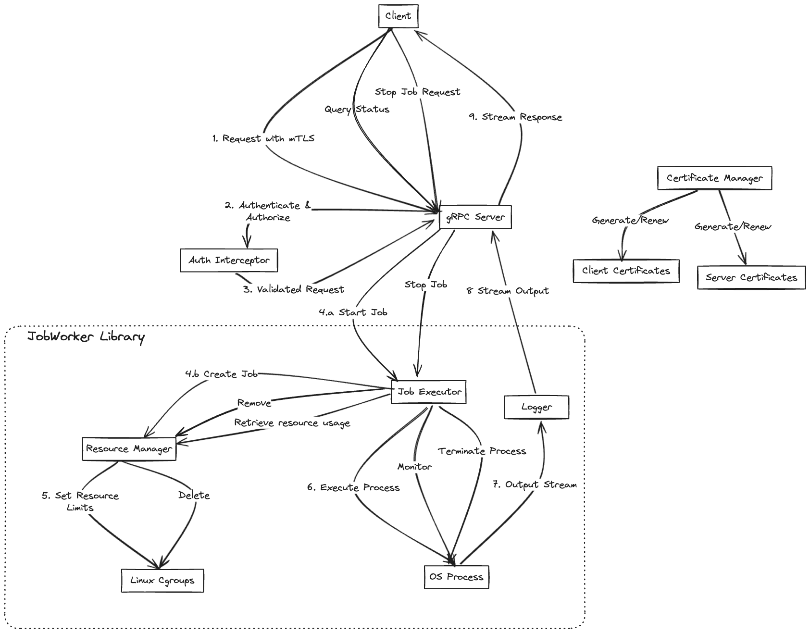

# RFD 0001 - Job Worker Service

## What

This RFD proposes a prototype job worker service that provides a secure API to run arbitrary Linux processes with fine-grained resource control and real-time output streaming. The service aims to demonstrate a scalable and secure approach to process execution in a multi-tenant environment.

## Why

To showcase a secure and efficient approach to running and managing arbitrary processes in a controlled environment.

## Design Overview

### Components

1. **Library**: A reusable job management library
2. **API**: A gRPC API server
3. **Client**: A command-line interface (CLI) client

### Key Features

- Job management (start, stop, query status, get output)
- Real-time output streaming with support for multiple concurrent clients
- Resource control using cgroups (CPU, Memory, Disk I/O)
- Secure communication using mTLS
- Simple role-based authorization scheme
- gRPC API for client-server communication

#### Key Considerations 
- This design is not a distributed system and is only optimized to run on a single linux OS
- If needed, the components of the library can be split into a distributed microservices framework inthe future

## Detailed Design

### 1. Library

#### a. In-memory Job Logger
- Implement a thread-safe buffer to store output from runnning the command
- Use a read-write mutex to ensure thread-safety for concurrent read/write operations
- Provide methods for adding logs, and getting a stream Reader to the log

```go
// Logger represents an in-memory buffer for storing job logs.

type Logger struct {
	mu   sync.RWMutex
	logs bytes.Buffer
}

// NewLogger creates a new Logger instance
func NewLogger() *Logger

// AddLog appends new output from processes to the logs buffer
func (l *Logger) AddLog(output []byte)

// Gets an instance of io.Reader that is able to read the data from the internal logs buffer
func (l *Logger) GetLogReader() io.Reader

// Size returns the current size of the logs buffer
func (l *Logger) Size() int

```

#### b. Job Executor
- Use `os/exec` package to create and manage child processes
- Implement non-blocking I/O for stdout/stderr capture using `io.Pipe()`
- Use a separate goroutine for each of stdout and stderr to prevent blocking
- Implement a context-based cancellation mechanism for graceful job termination
- Monitor resource usage using cgroups
- Provide callbacks for resource usage updates
- Use a Go channel to periodically read current resource usage (memory, I/O, and CPU usage) from the associated cgroup

```go
// Executor is responsible for running a job and managing its lifecycle.

// JobStatus represents the current state of the job
type JobStatus string

const (
	JobStatusPending   JobStatus = "PENDING"
	JobStatusRunning   JobStatus = "RUNNING"
	JobStatusCompleted JobStatus = "COMPLETED"
	JobStatusFailed    JobStatus = "FAILED"
	JobStatusStopped   JobStatus = "STOPPED"
)

type Executor struct {
	Command   string
	Args      []string
	cmd     *exec.Cmd
	logger  *logger.Logger
	resourceManager *resourcemanager.ResourceManager
	// Context to propagate state and cancellations
	ctx     context.Context
	cancel  context.CancelFunc
	started time.Time
	stopped time.Time
	mu      sync.Mutex
	status  JobStatus
}

// NewExecutor creates a new Executor for the given command and arguments.
// cgroupPath will be used to set the path of the cgroup relative to the root cgroup -> /sys/fs/cgroup/jobworker
func NewExecutor(command string, args []string, cgroupPath string) *Executor

// Start begins the execution of the job.
func (e *Executor) Start() error

// Stop terminates the running job.
func (e *Executor) Stop() error

// Get status of the job.
func (e *Executor) GetStatus() JobStatus

// Access the logger for the job
// Can be used to subscribe to output logs
func (e *Executor) GetLogger() *logger.Logger

func (e *Executor) GetStartTime() time.Time

func (e *Executor) GetStopTime() time.Time

// Wait blocks until the job is completed and returns its exit status.
func (e *Executor) Wait() error
```

#### d. Resource Manager
- We will create a hierarchical cgroup structure:
  ```
  /jobworker
  ├── user1
  │   ├── job1
  │   └── job2
  └── user2
      └── job3
  ```
- Create and manage cgroups for a single job
- Set and enforce resource limits
- Implement resource allocation strategies:
  - Use CPU shares for fair CPU allocation
  - Set memory limits with both soft and hard limits
  - Configure I/O weight for disk I/O prioritization
```go
// ResourceManager monitors and controls resource usage for a job.

// ResourceLimits defines the resource constraints for a job.
type ResourceLimits struct {
	CPUShares     uint64 // CPU shares (relative weight)
	MemoryLimit   uint64  // Memory limit in bytes
	IOReadBPS     uint64 // I/O read rate limit in bytes per second
	IOWriteBPS    uint64 // I/O write rate limit in bytes per second
	IOReadIOPS    uint64 // I/O read rate limit in operations per second
	IOWriteIOPS   uint64 // I/O write rate limit in operations per second
}

// ResourceManager represents the resources associated with a single job.
type ResourceManager struct {
	mutex sync.Mutex // Mutex for synchronizing access to this job's resources
	path  string     // Path to this job's cgroup
}

// NewResourceManager creates a new ResourceManager.
func NewResourceManager() *ResourceManager

// SetLimits sets resource limits for a job.
func (rm *ResourceManager) SetLimits(limits ResourceLimits) error

// Adds a process to the cgroup
func (rm *ResourceManager) AddProcess(pid int) error

// Removes a job's cgroups and cleans up associated resources.
func (rm *ResourceManager) Cleanup() error
```

### 2. API

#### gRPC API Specification

```protobuf
syntax = "proto3";

package jobworker;

import "google/protobuf/timestamp.proto";

// JobWorker service provides methods to manage and monitor jobs.
service JobWorker {
  // Starts a new job with the given command and resource limits.
  rpc StartJob(StartJobRequest) returns (StartJobResponse) {}
  
  // Stops a running job identified by its ID.
  rpc StopJob(JobId) returns (StopJobResponse) {}
  
  // Retrieves the current status of a job.
  rpc GetJobStatus(JobId) returns (JobStatusResponse) {}
  
  // Streams the output of a job.
  rpc GetJobOutput(stream JobOutputResquest) returns (stream JobOutputResponse) {}
}

// StartJobRequest contains the information needed to start a new job.
message StartJobRequest {
  // The command to be executed.
  string command = 1;
  
  // The arguments for the command.
  repeated string args = 2;
  
  // The resource limits for the job.
  ResourceLimits resource_limits = 3;
}

message JobId {
  // The UUID of the job.
  string id = 1;
}

// StartJobResponse contains the result of a job start request.
message StartJobResponse {
  // The UUID of the started job.
  string id = 1;
  
  // The initial status of the job.
  JobStatus status = 2;
}

// StopJobResponse contains the result of a job stop request.
message StopJobResponse {
  // The UUID of the stopped job.
  string id = 1;
  
  // The final status of the job.
  JobStatus status = 2;
  
  // The time when the job was started.
  google.protobuf.Timestamp start_time = 3;
  
  // The time when the job was stopped.
  google.protobuf.Timestamp stop_time = 4;
}

// JobStatusResponse contains the current status and resource usage of a job.
message JobStatusResponse {
  // The current status of the job.
  JobStatus status = 1;
}


// JobOutputRequest requests to the number of bytes to read from the output of a job.
// The server will keep streaming bytes_to_read number of bytes, until the client sends
// another request to change the number of bytes_to_read
message JobOutputRequest {
  string id = 1;
  unit64 bytes_to_read = 2;
}

// JobOutputResponse contains a chunk of output data from a job.
message JobOutputResponse {
  // output data from the job.
  bytes data = 1;
}

// ResourceLimits defines the resource constraints for a job.
message ResourceLimits {
  // The number of CPU shares allocated to the job.
  uint64 cpu_shares = 1;
  
  // The memory limit in bytes.
  uint64 memory_limit_bytes = 2;
  
  // The I/O weight for prioritizing disk I/O.
  uint64 io_weight = 3;
}

// JobStatus represents the possible states of a job.
enum JobStatus {
  // The job is waiting to be executed.
  PENDING = 0;
  RUNNING = 1;
  // The job has completed successfully.
  COMPLETED = 2;
  // The job has failed due to any number of reasons, including resource exahustion, fatal errors etc
  FAILED = 3;  
  // The job was stopped by user request.
  STOPPED = 4;
}
```

#### Authentication and Authorization
- Use mutual TLS (mTLS) for authentication
- Use X.509 certificate extensions to store role information
- Simple authorization scheme
  - User has access to only the jobs that they created

#### TLS Configuration
- TLS version: 1.3
- Cipher suites: 
  - TLS_ECDHE_ECDSA_WITH_AES_256_GCM_SHA384
  - TLS_ECDHE_RSA_WITH_AES_256_GCM_SHA384
  - TLS_ECDHE_ECDSA_WITH_CHACHA20_POLY1305_SHA256
  - TLS_ECDHE_RSA_WITH_CHACHA20_POLY1305_SHA256
- Key exchange: ECDHE with P-256 curve
- Certificate signature: ECDSA with P-256 curve and SHA-256

### 3. CLI Client

Implement a command-line interface with the following capabilities:
- `start`: Start a new job with resource limits
- `stop`: Stop a running job
- `status`: Get the current status and resource usage of a job
- `stream`: Stream the output of a running job

Example usage:
```bash
$ jobworker start "echo 'Life is Great'" --cpu-weight 1024 --memory-limit 100M --io-weight 100
Job started. ID: 550e8400-e29b-41d4-a716-446655440000

$ jobworker status 550e8400-e29b-41d4-a716-446655440000
Status: RUNNING

$ jobworker stream 550e8400-e29b-41d4-a716-446655440000
Life is Great

$ jobworker stop 550e8400-e29b-41d4-a716-446655440000
Status: STOPPED
Job ID: 550e8400-e29b-41d4-a716-446655440000
```

## Job Creation Flow

0. Client and Server TLS certificates are generated
1. Client sends job request with TLS
2. Server authenticates client and checks authorization using interceptors
3. Request is validated and JobExecutor instance is created to manage Job
4. JobExecutor passes cgroup path to ResourceManager to set limits
5. ResourceManager sets resource limits
6. Executor runs job within cgroup constraints
7. Output and resource usage are streamed to logger
8. Client requests output log stream
9. Logger streams logs to client(s)

Here's a visual representation of the job creation flow:


## Job Deletion Flow

All jobs are run using cancellable contexts. 

1. User sends StopJob request with JobId
2. Authentication & Authorization is done using interceptors as above
3. JobId is used to retrieve the correct job and the cancel is called on the context of the job
4. ResourceManager deletes cgroup path upon context cancellation
5. Logger's Close function is called upon context cancellation
6. Logger terminates all streams to subscribers

## Testing Approach

1. Authentication/Authorization layer
   - Test mTLS handshake with valid and invalid certificates
   - Test authorization checks for different roles

2. Networking and job management
   - Test job lifecycle (start, status, stream, stop)
   - Test concurrent output streaming
   - Test resource limit enforcement

## Edge Cases and Considerations

1. **Process Termination**: Implement forceful termination for unresponsive processes. Kill processes that don't respond to standard termination signals.

2. **Resource Exhaustion**: 
   - Monitor total resource usage and implement OOM killer
   - Keep track of total resource usage and only start processes from the queue if there are enough resources
   - Configure resources at the root level cgroup
   - Implement a hard limit by enabling the OOM killer, with a configurable percentage of the input Resource Limit

3. **Network Interruptions**: 
   - Ensure graceful handling of disconnections and reconnections
   - Stream logs from the beginning each time a streaming connection is established, as logs are stored in the Logger module

4. **Large Output Streams**: 
   - Consider persistent storage for large outputs
   - For this PoC, assume infinite memory, but note the need for a storage solution in production

5. **Concurrent Access**: 
   - Use in-memory logger to support multiple clients
   - Stream all output from the job to each client through goroutines when initiating the streaming gRPC to retrieve output

6. **Job Timeouts**: Implement configurable job timeouts

7. **Invalid Commands**: Consider input sanitization and process sandboxing (future enhancement)

8. **Certificate Expiration**: Implement certificate renewal policy (future enhancement)

## Future Enhancements

- Distributed architecture for high availability
- Container-based job isolation
- Enhanced security measures (e.g., input sanitization, process sandboxing)
- Certificate renewal automation
- Persistent storage solution for large output streams
- Improved error handling and recovery mechanisms
